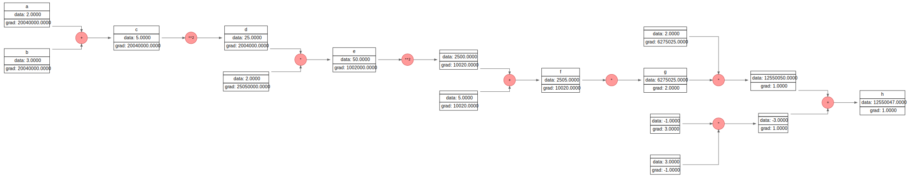

# Minigrad
A small automatic differentiation engine created by following Karpathy course.


<br>
MiniGrad is a minimalistic autograd engine and neural network library implemented in Python. It is designed to be simple, lightweight, and educational, making it a great tool for understanding the fundamentals of backpropagation and neural networks. The project only work with scalar values instead of Tensors. The goal here is just to get a better intuition about back propagation and how it is implemented in modern Deep Learning Framework like Pytorch.

# Features

- Autograd Engine: Implements automatic differentiation for scalar values.

- Neural Network Module: Provides building blocks for creating multi-layer perceptrons (MLPs).

- Computation Graph Visualization: Visualize the computational graph using Graphviz.

- Optimizers: Includes basic optimizers like Stochastic Gradient Descent (SGD).

# Usage

## Autograd Example

```python
from minigrad.engine import Value


a = Value(2.0, name = 'a')
b = Value(3.0, name = 'b')

c = b + a
c.name = 'c'
print(f"c.data: {c.data}")  # Should be 5.0

d = c ** 2
d.name = 'd'
print(f"d.data: {d.data}")  # Should be 25.0

e = d * 2
e.name = 'e'
print(f"e.data: {e.data}")  # Should be 50.0

f = e**2 + 5 
f.name = 'f'

print(f"f.data: {f.data}")  # Should be 2505

g = f * f 
g.name = 'g'

print(f"g.data: {g.data}")  # Should be 6275025.0

h = g * 2 - 3
h.name = 'h'

print(f"h.data: {h.data}")  # Should be 12550047.0

h.backward()

print("\nGradients:")
print(f"h.grad: {h.grad}")
print(f"g.grad: {g.grad}")
print(f"f.grad: {f.grad}")
print(f"e.grad: {e.grad}")
print(f"d.grad: {d.grad}")
print(f"c.grad: {c.grad}")
print(f"b.grad: {b.grad}") # dL/db 20040000.0 where L is the loss, and dL/dh = h.grad = 1
print(f"a.grad: {a.grad}") # dL/da 20040000.0 where L is the loss, and dL/dh = h.grad = 1

```


## Neural Network Example


```python
from minigrad.nn import MLP
from minigrad.engine import Value

# Create a multi-layer perceptron (MLP)
model = MLP(2, [16, 16, 1])  # 2 inputs, two hidden layers with 16 neurons, 1 output

# Forward pass
x = [Value(1.0), Value(2.0)]
output = model(x)

print(f"Output: {output.data}")

```

## Visualization

Visualize the computation graph using the `draw_nn` function:

```python
from minigrad.visualization import draw_nn

# Create some Value objects and perform operations
a = Value(2.0)
b = Value(3.0)
c = a + b
d = c.relu()

# Visualize the graph
draw_nn(d, filename='computation_graph', format='svg')

```



# Running Tests

To run the tests, navigate to the test folder and run pytest:

```bash
cd test
pytest test_engine.py
```